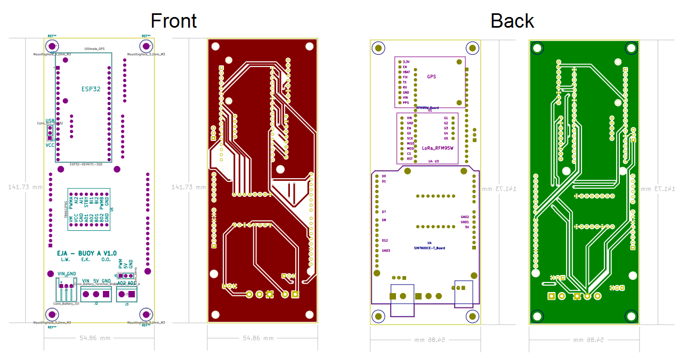

# EJA Intelligent Buoy A - Electronic Design

EJA Intelligent Buoy A - Electronic Design - 2020 Hackaday Dream Team Challenge for Conservation X Labs.

This repository contains the KiCad design for the PCB of the Intelligent Buoy A. It also contains the 3D models used to visualize the design in the KiCad 3D viewer.

## Main Components ##

## Schematic ##

## PCB Layout ##

## Assembly ##

Components List:

1. [ESP32-DEVKITC-32D](https://www.digikey.com/product-detail/es/espressif-systems/ESP32-DEVKITC-32D/1965-1000-ND/9356990)
2. [TB6612FNG MOTOR DRIVER BOARD](https://www.digikey.com/product-detail/es/sparkfun-electronics/ROB-14450/1568-1755-ND/7915576)
3. [CONN HDR 5POS 0.1 GOLD PCB](https://www.digikey.com/product-detail/es/sullins-connector-solutions/PPTC051LFBN-RC/S6103-ND/807239)
4. [CONN HEADER VERT 3POS 2.54MM](https://www.digikey.com/product-detail/es/jst-sales-america-inc/S2B-XH-A-1-LF-SN/455-4226-ND/9961922)
5. [CONN HDR 6POS 0.1 TIN PCB](https://www.digikey.com/product-detail/es/sullins-connector-solutions/PPTC061LFBN-RC/S7004-ND/810145)
6. [CONN HDR 8POS 0.1 TIN PCB](https://www.digikey.com/product-detail/es/sullins-connector-solutions/PPTC081LFBN-RC/S7006-ND/810147)
7. [CONN HDR 8POS 0.1 TIN PCB](https://www.digikey.com/product-detail/es/sullins-connector-solutions/PPTC081LFBN-RC/S7006-ND/810147)
8. [CONN HDR 8POS 0.1 TIN PCB](https://www.digikey.com/product-detail/es/sullins-connector-solutions/PPTC081LFBN-RC/S7006-ND/810147)
9. [CONN HDR 19POS 0.1 TIN PCB](https://www.digikey.com/product-detail/es/sullins-connector-solutions/PPTC191LFBN-RC/S7017-ND/810157)
10. [CONN HDR 19POS 0.1 TIN PCB](https://www.digikey.com/product-detail/es/sullins-connector-solutions/PPTC191LFBN-RC/S7017-ND/810157)
11. PCB Buoy A V1.0
12. [CONN HEADER R/A 3POS 2.5MM](https://www.digikey.com/product-detail/es/jst-sales-america-inc/S3B-XH-A-1-LF-SN/455-2954-ND/1556255)
13. [TERM BLK 3P SIDE ENT 5.08MM PCB](https://www.digikey.com/product-detail/es/on-shore-technology-inc/OSTTC032162/ED2610-ND/614559)
14. [TERM BLK 2P SIDE ENT 5.08MM PCB](https://www.digikey.com/product-detail/es/on-shore-technology-inc/OSTTC022162/ED2609-ND/614558)
15. [CONN HDR 9POS 0.1 GOLD PCB](https://www.digikey.com/product-detail/es/sullins-connector-solutions/PPPC091LFBN-RC/S7042-ND/810181)
16. [CONN HDR 9POS 0.1 GOLD PCB](https://www.digikey.com/product-detail/es/sullins-connector-solutions/PPPC091LFBN-RC/S7042-ND/810181)
17. 2 [CONN HDR 2POS 0.1 GOLD PCB](https://www.digikey.com/product-detail/es/sullins-connector-solutions/PPPC021LFBN-RC/S7035-ND/810174)
18. [CONN HDR 9POS 0.1 GOLD PCB](https://www.digikey.com/product-detail/es/sullins-connector-solutions/PPPC091LFBN-RC/S7042-ND/810181)
19. [CONN HDR 10POS 0.1 TIN PCB](https://www.digikey.com/product-detail/es/sullins-connector-solutions/PPTC101LFBN-RC/S7008-ND/810149)
20. [CONN HEADER VERT 3POS 2.54MM](https://www.digikey.com/product-detail/es/jst-sales-america-inc/S2B-XH-A-1-LF-SN/455-4226-ND/9961922)
21. [Adafruit Ultimate GPS](https://www.digikey.com/product-detail/es/adafruit-industries-llc/746/1528-1153-ND/5353613)
22. [RFM95W LoRa Radio](https://www.digikey.com/product-detail/es/adafruit-industries-llc/3072/1528-1667-ND/6005357)
23. [SIM7600CE-T 4G(LTE) Arduino Shield](https://www.mouser.com/ProductDetail/DFRobot/TEL0124?qs=17u8i%2FzlE88MEbXRJuYFsA==)

## Wiring Diagrams ##

